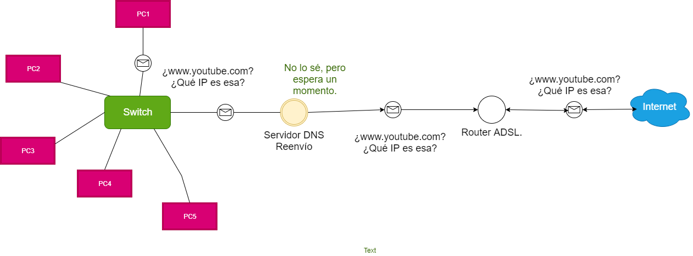

# Servidores de Solo Caché y de Reenvío.

En esta página aprenderás a cómo diferenciar y configurar un servidor DNS de Solo Caché y un servidor de Reenvío utilizando el servicio Webmin.

## Diferencias entre un servidor DNS de Solo Caché y uno de Reenvío.

### Reenvío.

Un servidor DNS de Reenvío, es un servidor "falso", ya que, no contiene ningúna zona maestra/esclava para que podamos configurar los registros como se hizo en la anterior actividad de "Instalar y configurar un servidor DNS", lo que hace este peculiar servidor es reenviar (de ahí el nombre) una solicitud DNS a otro servidor DNS y que este nos de la respuesta a la solicitud.

Como podemos apreciar en la imagen, el PC1 quiere entrar a: www.youtube.com pero no sabe su IP, entonces le manda la solicitud al servidor DNS, pero como es de reenvio, no tiene caché, ni zonas configuradas que se lo resuelvan, así que, se lo manda a Internet, es decir, a otro servidor DNS.

Si vemos la imagen, el otro servidor DNS proveniente de Internet, ya sabe la IP de la solicitud de: www.youtube.com que se la mandará a nuestro servidor DNS, para que luego, este la mande al PC1.

Ahora, si el PC3 quiere ir a: www.youtube.com nuestro servidor DNS, tendría que hacer lo mismo, es decir, reenviar la solicitud a Internet y que otro servidor DNS nos la resuelva por nosotros.

### Solo Caché.

Un servidor DNS de Solo Caché, es muy parecido al servidor de reenvío, este servidor tampoco tiene zonas maestras configuradas, cuando un cliente le pregunta por una solicitud DNS, primero revisa su caché, es decir, como un bloc de notas que contiene IP a nombres y viceversa, si en la caché está la respuesta de la solicitud, simplemente le responde al cliente con la respuesta, en el caso que no lo esté, realizará una consulta recursiva y el registro se guardará en la caché por un tiempo limitado, por si otro cliente quiere hacer la misma pregunta, al menos estará en la caché y no tendrá que hacer otra consulta recursiva.

Si observamos la siguiente imagen, el PC_B quiere entrar a: www.github.com, creará una consulta, ya que no sabe cual es la IP de esa página web, así que se la preguntará al servidor DNS.

Nuestro servidor DNS buscará en su caché, pero no ha encontrado la solución a la respuesta, es decir, no ha encontrado el registro de: www.github.com así que, realizará una consulta recursiva a otro servidor DNS para que nos de la respuesta correcta.

El otro servidor DNS nos contestará a la consulta que ha realizado nuestro DNS, la anotará en su caché temporalmente y le responderá al cliente.

Ahora, si en un corto periodo de tiempo, otro cliente (PC_E), vuelve a hacer una consulta a nuestro servidor DNS, con la misma dirección que el cliente anterior (www.github.com), no hace falta repetir todo el proceso, ya que, nuestro DNS ha almacenado la respuesta y se la mandará al segundo cliente.

----

Una  característica del servidor DNS de Reenvío, consiste en minimizar el tráfico sobre redes con conexiones externas lentas o que están muy congestionadas con respecto al servidor de Solo Caché.

Si vemos las imagenenes siguientes, el servidor DNS de Reenvío, utiliza mucho menos paquetes que el de Solo Caché.

[Dame click para ir a la página de cómo configurar un servidor de Reenvío.](Reenvío.md)

[Haz click para entrar en la página de cómo configurar un servidor de Solo Caché.](Solo Caché.md)
